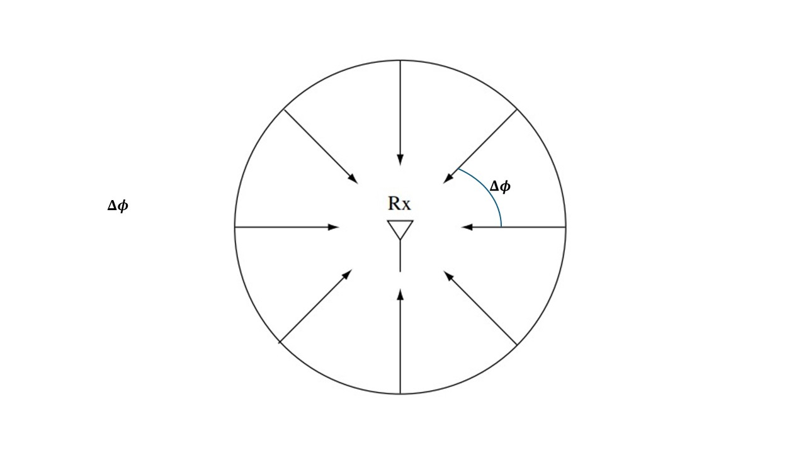
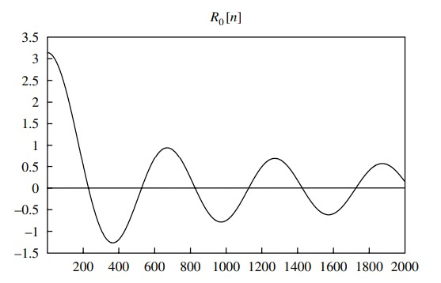
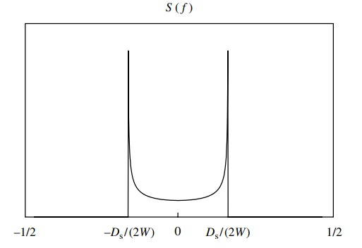

Imagine the scenario where a moving transmitter is transmitting pulses. Here, we will observe changes in the amplitudes, delays, and the number of multipath components. The corresponding received signal is the sum of the line-of-sight (LOS) path and all resolvable multipath components and is given by

$$
\begin{equation}
      r(t) = \sum_{n=0}^{N} \alpha_n(t) e^{j2\pi f_c(t-\tau_n(t)) + \Phi_{D_n}(t)}
\end{equation}
$$

where $N$ is the number of resolvable multipath components, $\alpha_n(t)$ and $\tau_n(t)$ are the amplitudes and delays respectively corresponding to the $n$-th path and $\Phi_{D_n}(t) = \int 2\pi f_{D_n}(t)dt$ is the doppler phase shift and $f_{D_n}(t)$ is the doppler frequency. Since the parameters $\alpha_n(t)$, $\tau_n(t)$ and $\Phi_{D_n}(t)$ associated with each resolvable multipath component change over time, they are characterized as random processes which we assume to be both stationary and ergodic. Thus, the received signal is also a stationary and ergodic random process.

Deriving the statistical properties of such a channel directly is intractable. Thus, Clarke's model introduces some simplistic assumptions to derive it. Assuming that $\alpha_n(t)$, $\tau_n(t)$ and $f_{D_n}(t)$ are changing slowly enough such that they are constant over the time intervals of interest, we have $\alpha_n(t) \approx \alpha_n$, $\tau_n(t) \approx \tau_n$ and $f_{D_n}(t) \approx f_{D_n}$. With this assumption the Doppler phase shift becomes $\Phi_{D_n}(t) = 2\pi f_{D_n}t$. The overall phase of the $n$-th multipath component is $\phi_n(t) = 2\pi f_c \tau_n - 2\pi f_{D_n}t$. We now make a key assumption: we assume that for the $n$-th multipath component the term $2\pi f_c τ_n$ in $\Phi_n(t)$ changes rapidly relative to all other phase terms. This is a reasonable assumption since $f_c$ is large and hence the term $2\pi f_c τ_n$ can go through a 360 degree rotation for a small change in multipath delay $τ_n$. Under this assumption $\Phi_n(t)$ is uniformly distributed on $[-\pi, \pi]$. Thus, we assume $N$ multipath components with angle of arrival $\Phi_n = n \Delta \Phi$, where $\Delta \phi = \frac{2\pi}{N}$ as depicted in the figure below.

  
*System model with arriving signals uniformly distributed in angle around the receiver; receiver motion not shown, but will be there leading to Doppler effects*

Since we assume flat-fading, i.e., the communication signal bandwidth $W$ is much smaller than the reciprocal of the delay spread, the complex baseband signal can be represented by a single tap at each time:

$$
\begin{aligned}
      y[m] = h_0[m]x[m] + w[m]
\end{aligned}
$$

## Discussion

Given our assumption that the phase of the arriving signal is uniformly distributed in $[0, 2\pi]$, and independently distributed across all angles of arrival $\theta$, the tap gain process $\{h_0[m]\}$ is a sum of many small independent contributions, one from each angle. Therefore, by the central limit theorem, it is reasonable to model the process as Gaussian. It can be shown that this process is stationary with autocorrelation function $R_0[n]$ given by:

$$
\begin{aligned}
      R_0[n] = 2a^2 \pi J_0 \left(\frac{n\pi D_s}{W}\right)
\end{aligned}
$$

where

$$
\begin{aligned}
      J_0(x) \triangleq \frac{1}{\pi} \int_0^\pi \exp(jx \cos\theta) \, d\theta
\end{aligned}
$$

is the zeroth order Bessel function of the first kind, and

$$
\begin{aligned}
      D_s = 2f_c\frac{v}{c}
\end{aligned}
$$

is the Doppler spread.

The power spectral density (PSD) can be obtained as usual by taking the Fourier transform of the auto-correlation function:

$$
\begin{aligned}
      S(f)=
      \begin{cases}
      \frac{4a^2W}{D_s \sqrt{1 - (2fW/D_s)^2}} & -\frac{D_s}{2W} \leq f \leq \frac{D_s}{2W} \\
      0 & \text{otherwise}
      \end{cases}
\end{aligned}
$$

|    *Autocorrelation of the tap gain process* |    *Power spectral density of tap gain process* |
|:----------------------------------------------------------------------------------:|:--------------------------------------------------------------------------:|

Finally, we can define the coherence time as the time it takes for the auto-correlation function to go below a certain threshold for the first time. Let us say this threshold is \(\alpha\). Then, the coherence time is the smallest value of \(\frac{n}{W}\) such that \(R_0[n] = \alpha R_0[0]\), yielding the expression:

$$
\begin{aligned}
      T_c = \frac{J_0^{-1}(\alpha)}{\pi D_s}
\end{aligned}
$$
