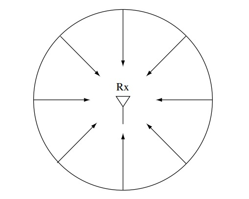

The Clarke's model is a statistical channel model that deals with wireless signal transmission in a very specific system model case (described in section [System model]).

## Assumptions

- Flat fading, i.e., the frequency response of the channel (modelled as an LTI system) is constant across all frequencies  
- Isotropic scattering, meaning the received multi-path signals arrive at uniformly distributed angles around the receiver  
- Linear relationship between input and output signals (Rayleigh fading model; this will be justified in section [Discussion](#discussion))

## System model

We have a mobile receiver moving at speed \(v\). The transmitted signal is scattered by stationary objects around the receiver. Let \(K\) be the number of multi-path components (MPCs). Then, aligned with our assumption in section [Assumptions](#assumptions), the \(i\)th MPC arrives at an angle of

$$
\begin{aligned}
\theta_i \triangleq \frac{2\pi i}{K}, \quad i = 0, 1, \dots, K-1
\end{aligned}
$$

with respect to the direction of motion. \(K\) is usually assumed to be a large number.

*System model with arriving signals uniformly distributed in angle around the receiver; receiver motion not shown, but will be there leading to Doppler effects*

The MPC arriving at angle \(\theta\) has a delay of \(\tau_\theta(t)\) and a time-invariant gain \(a_\theta\). Thus, the input-output relationship is given by:

$$
\begin{aligned}
y(t) = \sum_{i=0}^{K-1} a_{\theta_i} x(t - \tau_{\theta_i}(t))
\end{aligned}
$$

**Note:** In a more general version of the model, the received power distribution $p(\theta)$ and gain $a(\theta)$ can be taken as arbitrary functions of $\theta$, but in this experiment we shall stick to the uniform power distribution and isotropic antenna gain model.

Since we assume flat-fading, i.e., the communication signal bandwidth $W$ is much smaller than the reciprocal of the delay spread, the complex baseband signal can be represented by a single tap at each time:

$$
\begin{aligned}
y[m] = h_0[m]x[m] + w[m]
\end{aligned}
$$

## Discussion

Given our assumption that the phase of the arriving signal is uniformly distributed in $[0, 2\pi]$, and independently distributed across all angles of arrival $\theta$, the tap gain process $\{h_0[m]\}$ is a sum of many small independent contributions, one from each angle. Therefore, by the central limit theorem, it is reasonable to model the process as Gaussian. It can be shown that this process is stationary with autocorrelation function $R_0[n]$ given by:

$$
\begin{aligned}
R_0[n] = 2a^2 \pi J_0 \left(\frac{n\pi D_s}{W}\right)
\end{aligned}
$$

where

$$
\begin{aligned}
J_0(x) \triangleq \frac{1}{\pi} \int_0^\pi \exp(jx \cos\theta) \, d\theta
\end{aligned}
$$

is the zeroth order Bessel function of the first kind, and

$$
\begin{aligned}
D_s = 2f_c\frac{v}{c}
\end{aligned}
$$

is the Doppler spread.

The power spectral density (PSD) can be obtained as usual by taking the Fourier transform of the auto-correlation function:

$$
\begin{aligned}
S(f)=
\begin{cases}
\frac{4a^2W}{D_s \sqrt{1 - (2fW/D_s)^2}} & -\frac{D_s}{2W} \leq f \leq \frac{D_s}{2W} \\
0 & \text{otherwise}
\end{cases}
\end{aligned}
$$

|    *Autocorrelation of the tap gain process* |    *Power spectral density of tap gain process* |
|:----------------------------------------------------------------------------------:|:--------------------------------------------------------------------------:|

Finally, we can define the coherence time as the time it takes for the auto-correlation function to go below a certain threshold for the first time. Let us say this threshold is \(\alpha\). Then, the coherence time is the smallest value of \(\frac{n}{W}\) such that \(R_0[n] = \alpha R_0[0]\), yielding the expression:

\[
T_c = \frac{J_0^{-1}(\alpha)}{\pi D_s}
\]
